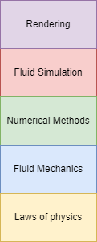

### Preface
My goal in writing this article is to provide a gentle introduction to fluid simulations for the average computer science student at undergraduate or postgraduate level. No background in fluid mechanics or numerical methods is required. I only expect you to have solid calculus foundations, some basic physics knowledge and any amount of exposure to vector calculus. But not to worry, I will provide additional clarification as needed.

### Introduction
Hello, I am Sharjeel Qaiser. I'm currently working at Creative Assembly as a graphics and VFX programmer. Before I joined the video games industry, I was always interested in simulating the real world - especially fluids, since they are just mesmerizing to look at. So I did what everyone else does and googled "fluid simulation tutorial", which made me stumble across a handful of nice articles on Medium, Nvidia's GPU gems article on simulating fluids, the godfather of fluids Jos Stam's work, the classic SPH paper and the fantastic book "Fluid Simulation for Computer Graphics" by Robert Bridson. All of these are fantastic resources in their own right, which provide great intuition and guide you through practical implementations of fluid solvers. 

So what can I add to all this great work already? I simply look at my past self, when I couldn't wrap my head around why this stuff works, and is this how fluids actually behave? I was uncomfortable leaving questions unanswered and "as a black-box" which is a common thing in computer sciencey lenses of engineering abstractions, so I went on Youtube and watched a bunch of videos on fluid mechanics. 

Somewhere along the line of doing that and solving a few textbook fluid problems, it sort of came together and clicked. I am by no means an expert in fluid mechanics now, but I think the actual derivation process, of the governing equations (and their own derivation and so on until we reach the physical laws they are based on) is so crucial in "understanding" fluids. It's actually quite similar to when you first learn about programming and you understand basic computers at a low level in terms of memory and processing, but you don't understand that massive abstraction layer that takes your compiled code into executable machine instructions once you take a course on operating systems or something. Similarly, I hope to at least point you in the right direction when it comes to demystifying the "abstraction layer" of fluid simulations that computer scientists probably should know about.

{: .mx-auto.d-block :}

*Figure 1: The pipeline of understanding fluid simulations*{: .mx-auto.d-block :}

That feeling of opening the metaphorical black box of fluids, locked with our limited exposure to real-world engineering is an extremely satisfying feeling, which I hope to impart on you through a couple of articles. I won't be guiding you through how to actually write a fluid solver with code in this first article, perhaps I'll save it for a later one (there's plenty of resources that do that already). But I'd like to motivate you, make it intuitive so that you are curious to learn more, because that is what I needed as well. Perhaps I can even convince you to go through a fluid mechanics course on your own by yourself!

### Navier-Stokes Equations

You've probably been exposed to the Navier-Stokes equations in some way or another if you're reading this article. It's typically introduced as the "big scary equations" of fluids, followed by a break down of the components which make up the equations. I will just display them below for reference (and because this tutorial would feel incomplete without seeing them in full form), but we're going to be deriving them ourselves from basic principles.

$$

\[nabla \cdot \mathbf{u} = 0]

\[frac{\partial \mathbf{u}}{\partial t} + (\mathbf{u} \cdot \nabla) \mathbf{u} = -\frac{1}{\rho} \nabla p + \nu \nabla^2 \mathbf{u} + \mathbf{f}]

$$